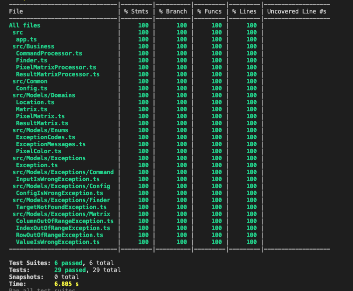

**Note :** You need to install **Node.Js** (v14.18.2) to run projects

- ### Installation

  ```bash
    git clone https://github.com/FazliSercanYilmaz/DottMatrix.git
    cd DottMatrix
    npm install
  ```

- ### Test
  ```bash
    npm run test:all
  ```
- ### Run

  ```bash
    npm start
  ```



- ### Linting
  ```bash
    npm run lint
  ```
- ### Environment
  ```bash
  TEST_CASE_MIN_SIZE ->  Sets minumum test case number. Default value is 1. Should be positive integer
  TEST_CASE_MAX_SIZE -> Sets maximum test case number. Default value is 1000. Should be positive integer
  MATRIX_MAX_ROW -> Sets maximum input matrix row length. Default value is 1000. Should be positive integer
  MATRIX_MIN_ROW -> Sets minumum input matrix row length. Default value is 1. Should be positive integer
  MATRIX_MAX_COLUMN -> Sets minumum input matrix column length. Default value is 1000. Should be positive integer
  MATRIX_MIN_COLUMN -> Sets minumum input matrix column length. Default value is 1. Should be positive integer
  ```
- ### Destcription
  This program calculates the nearest white distance for each input matrix element and output to result matrix. It uses bruce force algorithm to find nearest instance of white element. Program uses 0 for black points, 1 for white points.
- ### Example
- First line is testCase id.
- Second line is x and y dimentions of the matrix.
- Each other lines are row datas of the matrix. Each row data length should be equal to y dimention and should only include 0 or 1
  input:
  ```bash
  cmd:npm start
  cmd:1
  cmd:3 4
  cmd:0001
  cmd:0011
  cmd:0110
  ```
  output:
  ```console
  output:
  3 2 1 0
  2 1 0 0
  1 0 0 1
  ```
- ### Exceptions

  | Exception                   | Code | Message             |
  | --------------------------- | ---- | ------------------- |
  | `IndexOutOfRangeException`  | 100  | Index out of range  |
  | `ColumnOutOfRangeException` | 200  | Column out of range |
  | `RowOutOfRangeException`    | 300  | Row out of range    |
  | `ValueIsWrongException`     | 500  | Value is wrong      |
  | `ConfigIsWrongException`    | 600  | Config is wrong     |
  | `InputIsWrongException`     | 700  | Input is wrong      |
  | `TargetNotFoundException`   | 800  | Target not found    |

- ### Data & Logic Structures
  - #### enum PixelColor
    - BLACK = 0
    - WHITE = 1
  - #### class Matrix<T>
    - public getValue(location: Location): T -> returns value of given location
    - public setValue(location: Location, value: T): void -> sets value of given location
    - private checkLocation(location: Location): void -> validates location
    - public insertRow(rowData: Array<T>): number -> inserts row to matrix
  - #### class PixelMatrix extends Matrix<PixelColor>
  - #### class ResultMatrix extends Matrix<number>
  - #### interface IFinder<T>
    - public findDistanceMatrix(matrix: Matrix<T>, targetValue: T): Matrix<number> -> uses given algorithm to return distance matrix
  - #### class Finder<T> implements IFinder<T>
    - private findNearestDistance(location: Location, matrix: Matrix<T>, targetValue: T): number -> uses brute force algorithm to calculate nearest target distance from given location
    - private validateMatrix(matrix: Matrix<T>, targetValue: T): void -> gives error if the matrix doesn't target value
    - private calculateDistance(source: Location, target: Location): number -> calculates distance between source and target locations
  - #### interface IMatrixProcessor<T, Y extends Matrix<any>>
    - createMatrix(id: number, rowLength: number, columnLength: number): Y -> creates a empty matrix
    - insertRowToMatrix(rowData: T, matrix: Y) -> inserts row to given matrix
    - matrixToData(matrix: Y): T -> converts matrix to data
  - #### class PixelMatrixProcessor implements IMatrixProcessor<string, PixelMatrix>
    - private validatePixelColor(data: string): PixelColor -> validates if given string can be convert to number and equals to any pixel value
  - #### class ResultMatrixProcessor implements IMatrixProcessor<string | Array<number>, ResultMatrix>
    - private validateValue(data: number) -> validates if given number can be convert to number
  - #### class CommandProcessor
    - public getData(): Promise<Matrix<any>> -> reads cmd to create matrix
    - public saveData(data: Matrix<any>): void -> outputs matrix to cmd
    - private validateTestCase(line: string): number -> validates test case id
    - private validateRowColumnLength(line: string): { row: number; col: number } -> validates x and y dimensions for given input

_F.Sercan Yılmaz_

_For any problems or information_
email:[fazlisercanyilmaz@gmail.com](mailto:fazlisercanyilmaz@gmail.com?subject=Dott%20Case%20Information%20Request)  
phone: [+90 538 786 3537](tel:+905387863537)
